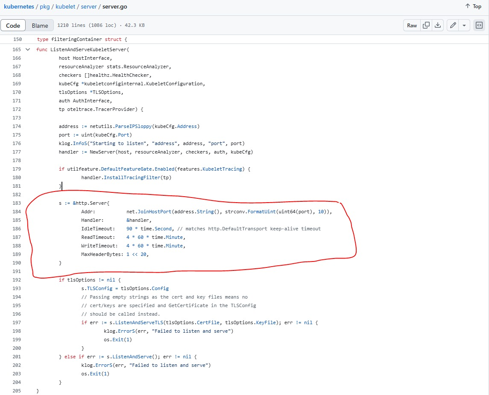

# Tailer Tool

## Overview
**Tailer** is a tool designed to dynamically monitor Kubernetes pod logs, ensuring that logs from all containers, including new and recreated pods, are collected without missing critical events. Tailer overcomes Kubernetes’ default connection timeout limitations and provides a robust solution for long-term log collection. Tools like Stern and Kail also face the same challenge due to Kubernetes’ default connection timeout limitations, which can disrupt long-term log monitoring. Tailer overcomes these issues and provides a robust solution for persistent log collection.

## Problem Statement
### Kubernetes Default Idle Connection Timeout (4h)
Kubernetes enforces a default idle connection timeout of 4 hours (`streamingConnectionIdleTimeout`). This timeout means that any log streaming session will be forcefully closed after 4 hours, regardless of whether data is still being streamed. This behavior can lead to:

1. **Interrupted Log Streaming**: Persistent log monitoring tools using `kubectl logs -f` may suddenly stop without an apparent reason, resulting in gaps in log collection.
2. **Confusion and Non-intuitive Defaults**: The default 4-hour timeout is not explicitly documented in many contexts, leaving users unaware of why their connections are dropping.
3. **Operational Challenges**: Systems requiring continuous log monitoring must implement their own mechanisms to detect and restart closed connections, adding complexity to tool design.



For more details, refer to:
- Kubernetes Issue [#104580](https://github.com/kubernetes/kubernetes/issues/104580)
- Kubernetes Discussion [#104595](https://github.com/kubernetes/kubernetes/issues/104595#issuecomment-906082442)

## Solution
Tailer mitigates these challenges by:
1. Periodically refreshing log streams to ensure no logs are missed.
2. Dynamically detecting new or recreated pods and starting log collection without manual intervention.
3. Excluding specific pods and containers as per user requirements.

## Features
- **Dynamic Pod Detection**: Automatically detects newly created or recreated pods.
- **Container Filtering**: Allows excluding specific containers or pods from log collection.
- **Log Refreshing**: Periodically refreshes all log streams to handle Kubernetes' default timeout.
- **Threaded Design**: Uses threads for efficient log collection from multiple pods and containers.
- **Customizable Arguments**: Provides CLI arguments for namespace, output file, excluded containers, and excluded pods.

## How It Works
### Key Components
1. **Dynamic Pod Tracking**: Tailer continuously monitors the namespace for newly created or recreated pods and dynamically starts log collection for all containers in those pods.
2. **Periodic Refresh**: Every 2 hours (default), Tailer refreshes log streams to avoid idle timeout issues.
3. **Exclusion Mechanism**: Users can specify pods or containers to exclude from log collection.
4. **Threaded Log Collection**: Each container log stream runs in its own thread for scalability.

### CLI Arguments
- `-n` or `--namespace`: Kubernetes namespace to monitor (required).
- `-o` or `--output-file`: Path to the file where logs will be saved (required).
- `--exclude-containers`: Comma-separated list of container names to exclude.
- `--exclude-pods`: Comma-separated list of pod names to exclude.

### Example Usage
```bash
python tailer.py -n my-namespace -o logs.txt --exclude-containers container1,container2 --exclude-pods pod1,pod2
```

### Output Example
```
Processing new pod: app-pod
  Tailing logs for container: app-container
  Tailing logs for container: sidecar-container
Refreshing logs...
Processing new pod: recreated-pod
  Tailing logs for container: main-container
```

## How to Run
1. Clone the repository containing the Tailer script.
2. Install Python (>= 3.6).
3. Ensure `kubectl` is installed and configured to access the target Kubernetes cluster.
4. Run the script with the desired arguments.

## Limitations
1. Tailer relies on `kubectl` for log collection, and its behavior is subject to Kubernetes API limitations.
2. Log streams may briefly pause during the periodic refresh cycle.

## Future Enhancements
- Support for specifying a custom refresh interval.
- Integration with logging frameworks like Fluentd or Loki for centralized log aggregation.
- Enhanced error handling for complex Kubernetes environments.

Tailer ensures reliable and robust log collection, mitigating challenges introduced by Kubernetes' connection timeout behavior.

